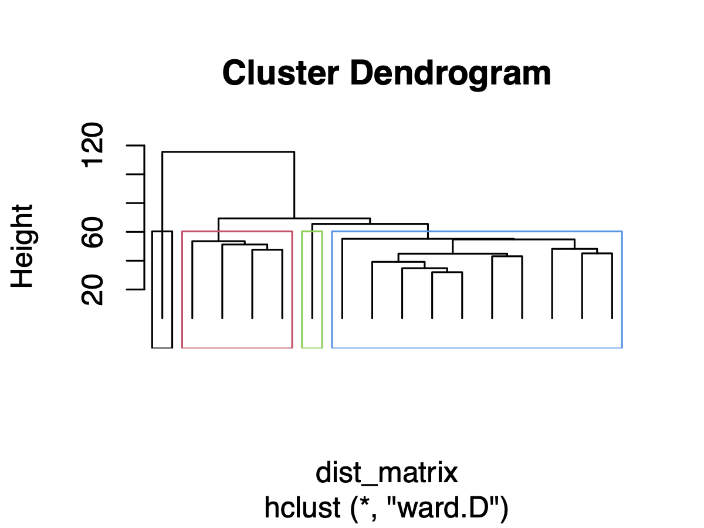

epiAneufinder is an algorithm used for calling Copy Number Variations (CNVs) from single-cell ATAC (scATAC) data.
Single-cell open chromatin profiling via the single-cell Assay for Transposase-Accessible Chromatin using sequencing (scATAC-seq) assay has become a mainstream measurement of open chromatin in single-cells. epiAneufinder exploits the read count information from scATAC-seq data to extract genome-wide copy number variations (CNVs) for each individual cell. It allows the addition of single-cell CNV information to scATAC-seq data, without the need of additional experiments, unlocking a layer of genomic variation which is otherwise unexplored. 

```{r, include = FALSE}
knitr::opts_chunk$set(
  collapse = TRUE,
  comment = "#>"
)
```

```{r setup,warning=FALSE}
library(epiAneufinder)
```

## Running the main function of epiAneufinder

The main function of epiAneufinder performs the following three steps:

* Data preparation (binning, GC correction, removal of blacklisted regions)
* Genome segmentation based on maximum Anderson-Darling distance
* Gain/loss assignments

It can be run as follows

```{r}
epiAneufinder(input="../sample_data/sample.tsv", 
              outdir="epiAneufinder_results", 
              blacklist="../sample_data/hg38-blacklist.v2.bed", 
              windowSize=1e5, 
              genome="BSgenome.Hsapiens.UCSC.hg38", 
              exclude=c('chrX','chrY','chrM'), 
              reuse.existing=TRUE,
              title_karyo="Karyogram of sample data", 
              ncores=4,
              minFrags=20000,
              minsizeCNV=0,
              k=4,
              plotKaryo=TRUE)
```

### Input formats 

In the example above, a fragment file is supplied, but different input formats are possible for EpiAneufinder. Alternatives are a directory with bam files per cell or an already generated count matrix. The file type is identified automatically. The fragment file needs to be a single file with the ending tsv or bed. For the count matrix, a directory with three files is required, called matrix.mtx, barcodes.tsv and peaks.bed. The bam files need all to be in one directory with a bam index file each.

The filtering options are dependent on the input file type. In case, a fragment file is provided the parameter `minFrags` filters cells with too less fragments. In case, a directory with bam files is provided the parameter `mapqFilter` filters low quality reads. For the option to provide directly a count matrix, no filtering is currently implemented.

**Note of caution** We compared the results of CNV calling with the peak matrix compared to fragment file as input. We used the SNU601 dataset as in the publication and compared with the scWGS dataset as groundtruth. The correlation between the CNVs is worse when using the matrix as input (0.74 from 0.85). We loose reads that are not in peak regions so overall we get less coverage over the genome. The result is that we can miss some gains and losses that would otherwise have been identified with the fragment input. So we would suggest a bit of caution in the interpretation of the results, but the comparison with the groundtruth the method still gives valid results.

### Parameters

The example is run on the genome hg38, but any other genome available at BSgenome can be used correspondingly, after installing the matching bioconductor package. Corresponding to the genome version, the correct `blacklist` file need to be provided to the function and the corrected naming of the excluded chromosomes (variable `exclude`).

The window size parameter defines the region size for the CNV predictions, counts within each bin will be aggregated and one CNV annotation for each bin is obtained.

The `minsizeCNV` parameter regulates the minimal number of consecutive bins required for a CNV annotation, i.e. each CNV will contain at least `minsizeCNV` bins. Setting the variable to 0 disables the restriction that a CNV needs to have a certain size and also CNVs with one bin can be called.

The `k` parameters regulates the number of iterations of the segmentation algorithm. A maximum of `2^k` CNVs can be found per chromsomes in `k` iterations. A large `k` parameter increases however the runtime substantially, so we set the default value to 4.

## Exploring the results

The epiAneufinder package contains different downstream functions for a more in depth
analysis of the CNV predictions, in particular to split the cells into different subclones and different additional plotting functions.

### Split karyogram into subclones

Subclones in the dataset can be identified based on hierarchical clustering of the identified CNVs. The dendogram is cut at a chosen depth `tree_depth`.

```{r}
#Load result table
res_table<-read.table("epiAneufinder_results/epiAneufinder_results/results_table.tsv")

#Need to reformat column names as dash are replaced by points in R
colnames(res_table)<-gsub("\\.","-",colnames(res_table))

subclones<-split_subclones(res_table,tree_depth=4,
                           plot_tree=TRUE,
                           plot_path="epiAneufinder_results/epiAneufinder_results/subclones.pdf",
                           plot_width=4,
                           plot_height=3)

#Data frame with the subclone split
head(subclones)

```

{width=60%}

### Annotated karyograms

Additional annotations can be added to the karyograms generated by epiAneufinder,
for example cell type annotations or the subclonal distribution identified by `split_subclones`.

We recommend to save the karyogram as a png, defined via the variable `plot_path`, as pdf versions
can get quite large.

```{r,fig.height=6,fig.width=8}
#Load result table
res_table<-read.table("epiAneufinder_results/epiAneufinder_results/results_table.tsv")

#Need to reformat column names as dash are replaced by points in R
colnames(res_table)<-gsub("\\.","-",colnames(res_table))

annot_dt<-data.frame(cell=subclones$cell,
                     annot=paste0("Clone",subclones$subclone))


plot_karyo_annotated(res_table=res_table,
                     plot_path="epiAneufinder_results/epiAneufinder_results/karyo_annotated.png",
                     annot_dt=annot_dt)

```

{width=100%}

### Aneuploidy scores and heterogeneity scores

The resulting CNVs (i.e. the karyogram) can be characterised based on the
aneuploidy and heterogeneity score, both implemented in the epiAneufinder function `karyotype_measures()`. Given a CNV result matrix with $N$ cells and $T$ bins and each entry being the CNV status $c_{i,j}$ for cell $i$ and bin $j$, the metrics are defined as:

* **Aneuploidy**: the mean deviation from the baseline value b (default $b=1$), i.e. how many bins are gained or lost per cell

\[
H = \frac{1}{T * N} \sum_{n=1}^{N} \sum_{t=1}^{T} |c_{n,t} - b|
\]

* **Heterogeneity**: the mean heterogeneity for a bin across cells, i.e. how different is the CNV status across cells for the same bin. For this, across each bin, the frequenies for each CNV status f is estimated as $m_f$ and then ordered decreasing so that $m_{0,t} >= m_{1,t}  >= m_{2,t}$

\[
H = \frac{1}{T * N} \sum_{t=1}^{T} \sum_{f=0}^{S} f * m_{f,t}
\]


Both metrics are implemented genome-wide and per chromosome.

```{r}

res_table<-read.table("epiAneufinder_results/epiAneufinder_results/results_table.tsv")
metrics<-karyotype_measures(res_table)

metrics$genomewide

head(metrics$per_chromosome)

```

### CNV burden per cell

Based on the same formular, the aneuploidy score per cell, also called CNV burden, can be estimated. This score per cell can be used as an additional criterion to identify tumor cells besides marker gene expression.

```{r,fig.height=3,fig.width=5}

res_table<-read.table("epiAneufinder_results/epiAneufinder_results/results_table.tsv")
cnv_burden_cell <-cnv_burden_per_cell(res_table)

hist(cnv_burden_cell)

```


### Read profile for individual cells

The predictions of epiAneufinder on individual cells can be further explored by
evaluating the count profile of each cell. The set of cells for detailed investigation
can be either subsampled randomly by assigning an integer value to the parameter `selected_cells`, then this number of cells are sample. Or a vector of barcodes can be given directly to `selected_cells`.

```{r,fig.height=6,fig.width=8}
outdir<-"epiAneufinder_results/epiAneufinder_results/"

#Version 1 - Selected a specific set of barcodes, e.g. based on subclones
cell_barcodes<-subclones$cell[subclones$subclone==1]
cell_barcodes

plot_single_cell_profile(outdir,
                         threshold_blacklist_bins=0.85,
                         selected_cells=cell_barcodes,
                         plot_path=paste0(outdir,"individual_tracks_clone1.pdf"),
                         plot_width=25,
                         plot_height=15)

#Version 2 - Randomly subsampling a certain number of cells
plot_single_cell_profile(outdir,
                         threshold_blacklist_bins=0.85,
                         selected_cells=3,
                         plot_path=paste0(outdir,"individual_tracks_random_subsample.pdf"),
                         plot_width=25,
                         plot_height=15)
```

{width=100%}